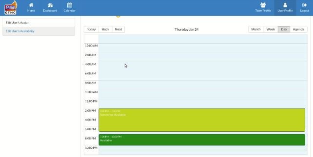

# Independent Study
#### Coding the Craziness - Spring 2019

## Table of Contents
1. [Week 4: Jan. 28, 2019](#week-4)
2. [Week 5: Week 5: Feb. 04, 2019](#week-5)

## Week 4
### Jan. 28, 2019
##### Anesu
This week we launched GTHC.io to white tenters. Within 24 hours of launching, we nearly doubled our user count from 130 to 240. Below are some of the analytics after launch.

##### Aman
We completed the updated Availability this week as well. 

###### Before:

###### After:

## Week 5
### Feb. 04, 2019

##### Aman
This week there were multiple bugs on the new Availability that were fixed this week:
- Deleting Availability
- Changing Availability type

Other bugs were discovered for availability and are currently being worked on:
- Availability overlap conflicts
- Moving availability slot bug

Other non-Availability bugs/issues found:
- Dashboard shifts is not in order of days [(see issue here)](https://github.com/GTHC/web/issues/74) 
- Dashboard Hour Breakdown is not showing nights [(see issue here)](https://github.com/GTHC/web/issues/75)
- Remove Team Picture holder from Team Profile [(see issue here)](https://github.com/GTHC/web/issues/76)

On our proposal, notifications were meant to be the tasks we have been working on the last two weeks, but due to user demands, that had moved to the updated Availability. What has been done for notification feature:
Finding potential design methods and libraries for this feature 

## Week 5
### Feb. 11, 2019

##### Aman
This week I have only worked on fixing the following:
- Fixing the issue with the dashboard hour breakdown (mentioned in last week's journal)
- Learning more about ActionCable and how we could possibly use it for notifications
